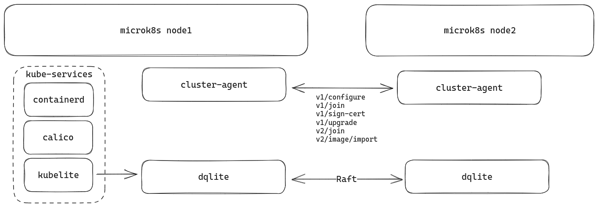

# Deploy microk8s + microceph in multiple nodes

## Purpose

This document show how to deploy microk8s cluster which integrate with microceph cluster as a external ceph StorageClass.

## Architecture

### Single node microk8s

If we take a look at the single node microk8s which install from channel 1.28/stable, the components will look like this:


We can see **kubelite** daemon runs as subprocesses the scheduler, controller, proxy, kubelet, and apiserver.

Also the apiserver is connect to **k8s-dqlite** with [kine](https://github.com/k3s-io/kine), which runs the dqlite datastore that is used to store the state of Kubernetes to replace etcd as default.

The dqlite cluster use the Raft based protocol where an elected leader holds the definitive copy of the database to make sure the high availability.

The source code of microk8s is from the upstream kubernetes but include some patches, the trace those patches from source code we can do:

```sh
git clone https://github.com/canonical/microk8s.git
git checkout 1.28

# List all the repositories to build microk8s
find ./build-scripts/components -type f -regex ".*repository" | xargs cat

# List all the patch files
find ./build-scripts/components -type f -regex ".*patch"
```

To see the service run on the microk8s host, we can use below commands:

```sh
snap services microk8s

microk8s.daemon-apiserver-kicker  enabled  active    -
microk8s.daemon-apiserver-proxy   enabled  inactive  -
microk8s.daemon-cluster-agent     enabled  active    -
microk8s.daemon-containerd        enabled  active    -
microk8s.daemon-etcd              enabled  inactive  -
microk8s.daemon-flanneld          enabled  inactive  -
microk8s.daemon-k8s-dqlite        enabled  active    -
microk8s.daemon-kubelite          enabled  active    -

pa aux | grep calico

root        4980  2.8  0.3 1829316 62052 ?       Sl   Sep27  40:49 calico-node -felix
root        4981  0.0  0.3 1312936 49608 ?       Sl   Sep27   0:05 calico-node -monitor-token
root        4982  0.0  0.3 1386412 49420 ?       Sl   Sep27   0:07 calico-node -monitor-addresses
root        4983  0.0  0.3 1312680 53412 ?       Sl   Sep27   0:09 calico-node -allocate-tunnel-addrs
root        4984  0.0  0.3 1312424 50024 ?       Sl   Sep27   0:08 calico-node -status-reporter
ubuntu   2094581  0.0  0.0   7004  2072 pts/0    S+   16:08   0:00 grep --color=auto calico
```

Read more:

- [Configuring Microk8s services](https://microk8s.io/docs/configuring-services)
- [Services and ports](https://microk8s.io/docs/services-and-ports)

### microk8s Cluster



For cluster mode, we can see cluster-agent become the entrypoint to trigger those join/sing-cert/configuring tasks.
The architecture is very similar to single node but just some service become a cluster.

Read more:

- [High Availability](https://microk8s.io/docs/high-availability)

### Microceph cluster


The microceph snap packages all the required ceph-binaries, [dqlite](https://dqlite.io/) and a small management daemon (microcephd) which ties all of this together. Using the light-weight distributed dqlite layer, MicroCeph enables orchestration of a ceph cluster in a centralised and easy to use manner.

> See [HACKING.md](https://github.com/canonical/microceph/blob/main/HACKING.md) for more details.


## Requirement

- multipass

## Install dependency

We will use multipass to simulate three machines in single instance. This step can be replaced if you have multiple machines in real world.

```sh
sudo snap install multipass
```

## Launch vms

```sh
# We will use 3 nodes for deployment.
export NODES=(1 2 3)

for number in $NODES ; do \
	multipass launch -c 4 -m 8G -d 30G jammy -n node-$number ; \
done

export EXEC_ON_FIRST_NODE="multipass exec node-1"
```

## Deploy microk8s cluster using snap

```sh
# For each node, install microk8s from the channel 1.28/stable using snap.
for number in $NODES ; do \
	multipass exec node-$number -- sudo snap install microk8s --channel 1.28/stable --classic; \
done

# For each node, wait until all the microk8s indicates that it is ready.
for number in $NODES ; do \
	multipass exec node-$number -- sudo microk8s status --wait-ready ; \
done

# For each node, excluding the first node, generate the join command on the first node then execute it on the respective target node.
for number in $NODES ; do \
	if [ $number != 1 ]; then \
                join_cmd=$(eval $EXEC_ON_FIRST_NODE -- sudo microk8s add-node | grep "microk8s join" | head -n 1) ; \
		multipass exec node-$number -- eval sudo $join_cmd ; \
	fi \
        ;
done
```

## Deploy microceph cluster using snap

```sh
# For each node, install microceph from the channel latest/edge using snap.
for number in $NODES ; do \
	multipass exec node-$number -- sudo snap install microceph --channel latest/edge ; \
done

eval $EXEC_ON_FIRST_NODE -- sudo microceph cluster bootstrap
eval $EXEC_ON_FIRST_NODE -- sudo microceph cluster list

# The step to create cluster in microceph is similar to microk8s. We generate the token on the first node and used it on the target node.
for number in $NODES ; do \
	if [ $number != 1 ]; then \
		token=$(eval $EXEC_ON_FIRST_NODE -- sudo microceph cluster add node-$number) ; \
		multipass exec node-$number -- sudo microceph cluster join $token ; \
	fi \
        ;
done

eval $EXEC_ON_FIRST_NODE -- sudo microceph cluster list

# On each node, create OSD.
for number in ${NODES} ; do \
	multipass exec node-$number -- bash -c \
		'for l in a b c; do \
			loop_file="$(sudo mktemp -p /mnt XXXX.img)" ; \
			sudo truncate -s 1G "${loop_file}" ; \
			loop_dev="$(sudo losetup --show -f "${loop_file}")" ; \
			minor="${loop_dev##/dev/loop}" ; \
			sudo mknod -m 0660 "/dev/sdi$l" b 7 "$minor" ; \
			sudo microceph disk add --wipe "/dev/sdi$l" ; \
		done' ; \
done

eval $EXEC_ON_FIRST_NODE -- sudo microceph status
eval $EXEC_ON_FIRST_NODE -- sudo microceph.ceph status
eval $EXEC_ON_FIRST_NODE -- sudo microceph disk list
```

## Enable microceph on microk8s

### Integration between microk8s and microceph


When we enable the rook-ceph addons, which is a core-plugin in microk8s, actually we use helm in the backend to install the rook on ceph-rook namespace.

> See [microk8s-core-addons](https://github.com/canonical/microk8s-core-addons/tree/main/addons/rook-ceph) for more details.

Then we use the [plugin script](https://github.com/canonical/microk8s-core-addons/blob/main/addons/rook-ceph/plugin/connect-external-ceph), which will auto-detect the local's microceph, to define a [CephCluster CRD](https://rook.io/docs/rook/v1.12/CRDs/Cluster/ceph-cluster-crd/), which connects to external ceph(microceph) and run a series of operation action to import secret, import user, and create storage class.

```sh
eval $EXEC_ON_FIRST_NODE -- sudo microk8s enable rook-ceph
eval $EXEC_ON_FIRST_NODE -- sudo microk8s connect-external-ceph
```

## Enable ceph dashboard

Using `microceph.ceph mgr` command to enable dashboard module. Also create a self-signed certification, create a user `admin` with password `adminadmin`.

```sh
eval $EXEC_ON_FIRST_NODE -- sudo microceph.ceph mgr module enable dashboard
eval $EXEC_ON_FIRST_NODE -- sudo microceph.ceph dashboard create-self-signed-cert
# Create user admin which password is adminadmin.
eval $EXEC_ON_FIRST_NODE -- bash -c 'echo adminadmin | sudo tee /root/pwd.txt'
eval $EXEC_ON_FIRST_NODE -- sudo microceph.ceph dashboard ac-user-create admin -i /root/pwd.txt administrator
eval $EXEC_ON_FIRST_NODE -- sudo microceph.ceph mgr services
```

## Deploy stateful-set

Deploy below statefulset yaml:

```yaml
apiVersion: apps/v1
kind: StatefulSet
metadata:
  name: k8s-summit-demo
spec:
  selector:
    matchLabels:
      app: nginx
  serviceName: "nginx"
  replicas: 3
  minReadySeconds: 5
  template:
    metadata:
      labels:
        app: nginx
    spec:
      terminationGracePeriodSeconds: 10
      containers:
      - name: nginx
        image: registry.k8s.io/nginx-slim:0.8
        ports:
        - containerPort: 80
          name: web
        volumeMounts:
        - name: demo-volume-1
          mountPath: /usr/share/nginx/html
  volumeClaimTemplates:
  - metadata:
      name: demo-volume-1
    spec:
      accessModes: [ "ReadWriteOnce" ]
      storageClassName: ceph-rbd
      resources:
        requests:
          storage: 1Gi
```

Transfer file into first node and deploy it with microk8s kubectl command

```sh
multipass transfer ./stateful-set.yaml node-1:
eval $EXEC_ON_FIRST_NODE -- sudo microk8s kubectl apply -f ./stateful-set.yaml
```
