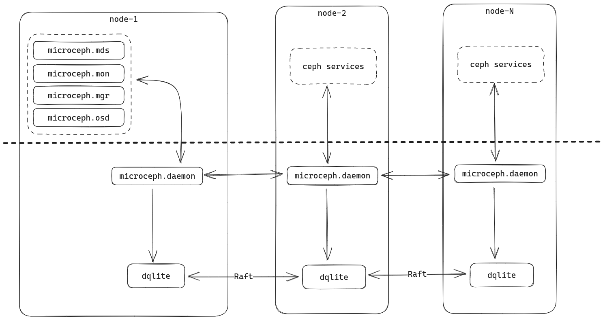

# Deploy microk8s + microceph in multiple nodes

## Purpose

This document show how to deploy microk8s cluster which integrate with microceph cluster as a external ceph StorageClass.

## Requirement

- multipass

## Quick deploy

```sh
make launch-vms
make deploy-microk8s
make deploy-microceph
make microk8s-enable-ceph

make deploy-stateful-set
```

## Architecture



