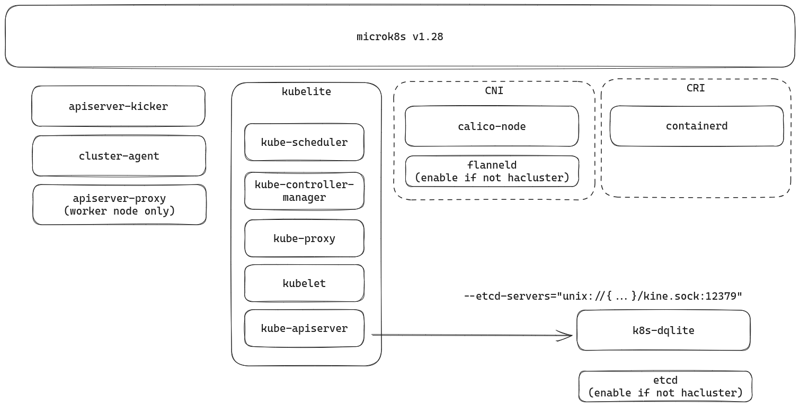

# Microk8s architecture

## Projects

- [microk8s](https://github.com/canonical/microk8s)
- [k8s-dqlite](https://github.com/canonical/k8s-dqlite)
- [microk8s-cluster-agent](https://github.com/canonical/microk8s-cluster-agent)
- addons
    - [microk8s-community-addons](https://github.com/canonical/microk8s-community-addons)
    - [microk8s-core-addons](https://github.com/canonical/microk8s-core-addons)


## Refenences

- https://microk8s.io/docs/configuring-services
- https://microk8s.io/docs/services-and-ports


## Trace into code

```sh
git clone https://github.com/canonical/microk8s.git
git checkout 1.28


# List all the repositories to build microk8s
find ./build-scripts/components -type f -regex ".*repository" | xargs cat

# List all the patch files
find ./build-scripts/components -type f -regex ".*patch"

```


### Single node

If we take a look at the single node microk8s which install from channel 1.28/stable, the components will look like this:



We can see **kubelite** daemon runs as subprocesses the scheduler, controller, proxy, kubelet, and apiserver.

Also the apiserver is connect to **k8s-dqlite** with [kine](https://github.com/k3s-io/kine), which runs the dqlite datastore that is used to store the state of Kubernetes to replace etcd as default.

The dqlite cluster use the Raft based protocol where an elected leader holds the definitive copy of the database to make sure the high availability.

To see the service run on the microk8s host, we can use below commands:

```sh
snap services microk8s

microk8s.daemon-apiserver-kicker  enabled  active    -
microk8s.daemon-apiserver-proxy   enabled  inactive  -
microk8s.daemon-cluster-agent     enabled  active    -
microk8s.daemon-containerd        enabled  active    -
microk8s.daemon-etcd              enabled  inactive  -
microk8s.daemon-flanneld          enabled  inactive  -
microk8s.daemon-k8s-dqlite        enabled  active    -
microk8s.daemon-kubelite          enabled  active    -

pa aux | grep calico

root        4980  2.8  0.3 1829316 62052 ?       Sl   Sep27  40:49 calico-node -felix
root        4981  0.0  0.3 1312936 49608 ?       Sl   Sep27   0:05 calico-node -monitor-token
root        4982  0.0  0.3 1386412 49420 ?       Sl   Sep27   0:07 calico-node -monitor-addresses
root        4983  0.0  0.3 1312680 53412 ?       Sl   Sep27   0:09 calico-node -allocate-tunnel-addrs
root        4984  0.0  0.3 1312424 50024 ?       Sl   Sep27   0:08 calico-node -status-reporter
ubuntu   2094581  0.0  0.0   7004  2072 pts/0    S+   16:08   0:00 grep --color=auto calico
```


Read more:

- [Configuring Microk8s services](https://microk8s.io/docs/configuring-services)
- [Services and ports](https://microk8s.io/docs/services-and-ports)


### Cluster


For cluster mode, we can see cluster-agent become the entrypoint to trigger those join/sing-cert/configuring tasks.
The architecture is very similar to single node but just some service become a cluster.

Read more:

- [High Availability](https://microk8s.io/docs/high-availability)
